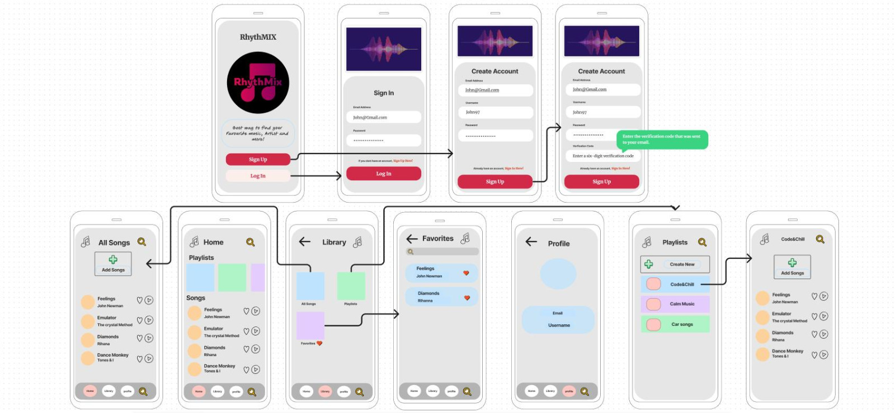
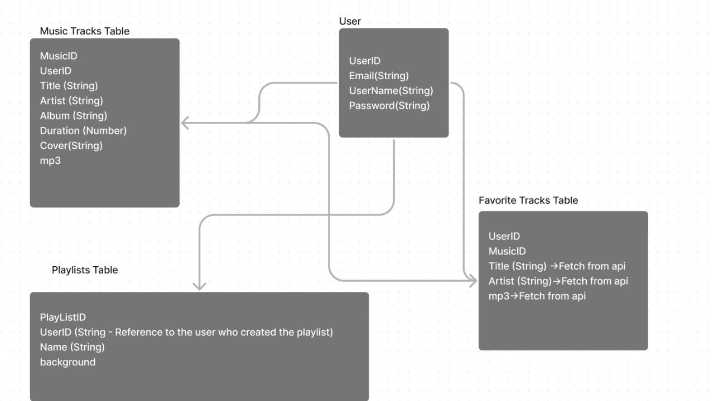

# **Team Agreement**

## Cooperation Plan
### ✨  Key Strengths

   ` Ahmad Anshasi`
   - Strengths: Strong organizational and time management skills.
   - Utilization: Creativity and innovation.
   - Competency Development: Enhance technical skills through collaboration.
---
   ` Balqees Al-Qudah`
   - Strengths: has positive attitude and continues learning.
   - Utilization: Project planning, task scheduling, and coordination.
   - Competency Development: Enhance time management skills.
--- 
  `  Farah El-Aydi`
   - Strengths: Effective communication, leadership qualities.
   - Utilization: Facilitate team meetings, act as a liaison with external stakeholders.
   - Competency Development: Improve technical expertise.
---
   ` Reneh Al-Madanat`
   - Strengths: Excellent problem-solving skills, attention to detail.
   - Utilization: Assign critical and complex tasks, involve in troubleshooting.
   - Competency Development: Enhance teamwork and communication skills.

### ✨  Day-to-Day Approach

  >  Daily stand-up meetings to discuss progress and challenges.
  >  Rotation of responsibilities to ensure everyone gains a comprehensive understanding.
  >  Encourage open communication and idea-sharing.
  >  Decision-making through consensus rather than individual preferences.
  
------------

## Conflict Plan
✨  Conflict Resolution
  - Address conflicts openly and respectfully.
  - Seek common ground and compromise.
  - Involve a neutral mediator if necessary.

✨  Preventing Dominance
  - Regular check-ins during team meetings to ensure everyone's input.
  - Encourage team members to voice concerns if someone dominates.
  - Rotation of leadership roles to distribute responsibility.

✨  Skill and Understanding Disparities
  - Establish a mentorship system for knowledge sharing.
  - Provide resources and training sessions for skill development.
  - Emphasize collaboration over individual performance.

✨  Addressing Inadequate Contributions
  - Transparent communication about expectations.
  - Encourage peer feedback in a constructive manner.
  - If issues persist, escalate to team leaders or instructors.

✨ Escalation
  - If conflicts persist, involve instructors for mediation.
  - Document issues and resolutions for future reference.

------------

## Communication Plan
 ✨ Availability and Platforms
   - Availability: 9 am to 6 pm, everyday.
   - Platforms: Slack & WhatsApp for daily communication, Zoom for meetings.

 ✨  Breaks and Falling Behind
  - Schedule breaks during long work sessions.
  - Notifying the team immediately if falling behind.
  - Collective problem-solving for catching up.

✨   After-Hours Communication
  - Emergency communication via Slack or WhatsApp.

✨   Inclusive Environment
  - Scheduled brainstorming sessions.
  - Regularly checking-in on team dynamics during meetings.

## Work Plan
✨   Task Management
  - Identifying tasks in team meetings.
  - Assigning tasks based on individual strengths.
  - Using JIRA board Trello for task tracking and management.

✨   Work Hours and Collaboration
  - Working hours: 9 am to 9 pm, everyday.
  - No solo coding during non-working hours.
  - Collaboration on challenging problems to enhance teamwork.

✨  Schedule for Practice Session
  - Coordinating with the instructor for a practice session.
  - Practice run and feedback session during the class before the presentation.

✨  Presentation Etiquette
  - Expressing gratitude sincerely.
  - Maintaining eye contact with the audience or camera.
  - Maintaining a positive attitude during the presentation.

## Git Process
✨  GitHub Components
  - Codebase and project documentation.

✨  Repository Sharing
  - Share repository links through Slack.

✨  Git Flow
  - Feature branches for tasks.
  - Pull Request (PR) review workflow.

✨  PR Review Workflow
  - Two or more reviewers per PR.
  - Team lead merges PRs after approval.
  - Regularly scheduled merges.
  - Communication via Slack & WhatsApp when it's time to merge.

## WireFrames

## User Stories

https://ricepify0.atlassian.net/jira/software/projects/RYT/boards/2

## Database Schema Diagram

